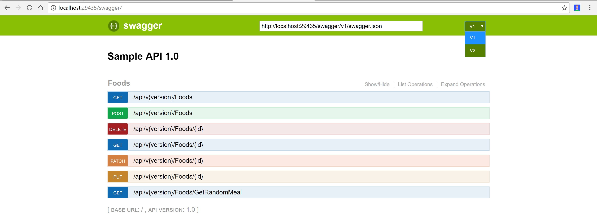
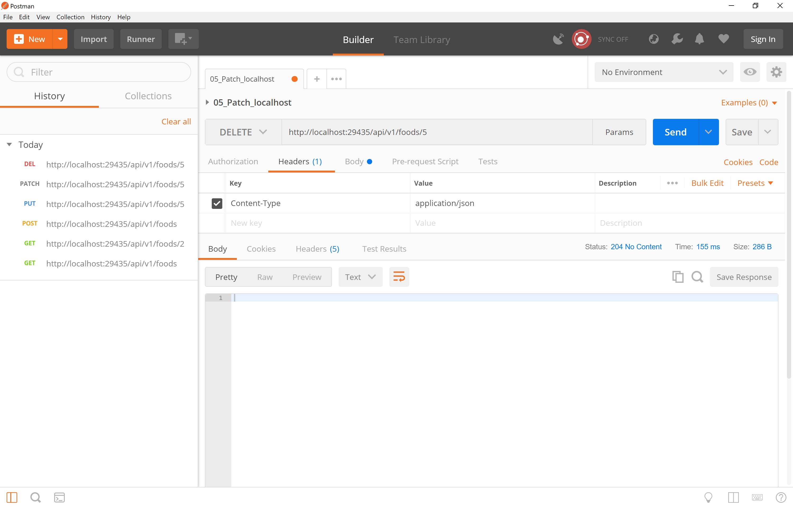

# ASP.NET Core WebApi Sample with HATEOAS, Versioning & Swagger

In this repository is .NET Testing Assignment. 

TASK:
Create a simple ASP .NET MVC application in C# to manage invoices in any database system. The application should have the following features:


creating/editing an invoice,
adding/removing invoice items.


Another part of the application is to create a simple API. Correct security key needs to be located in the request header to access the endpoints.

Please prepare the following endpoints:


get collection of unpaid invoices,
pay invoice (change status to paid),
edit invoice (PATCH request).

This repository contains a controller which is dealing with InvoiceItems. You can GET/POST/PUT/PATCH and DELETE them.

Hope this helps.

See the examples here: 

## Versions

``` http://localhost:29435/swagger ```



## GET all Invoices

``` http://localhost:29435/api/v1/Invoices ```

![ASPNETCOREWebAPIGET]

## GET single Invoice

``` http://localhost:29435/api/v1/Invoices/2 ```


## POST a InvoiceItem

``` http://localhost:29435/api/v1/Invoices ```


## PUT a InvoiceItem

``` http://localhost:29435/api/v1/Invoices/5 ```


## PATCH a InvoiceItem

``` http://localhost:29435/api/v1/Invoices/5 ```


## DELETE a InvoiceItem

``` http://localhost:29435/api/v1/Invoices/5 ```



